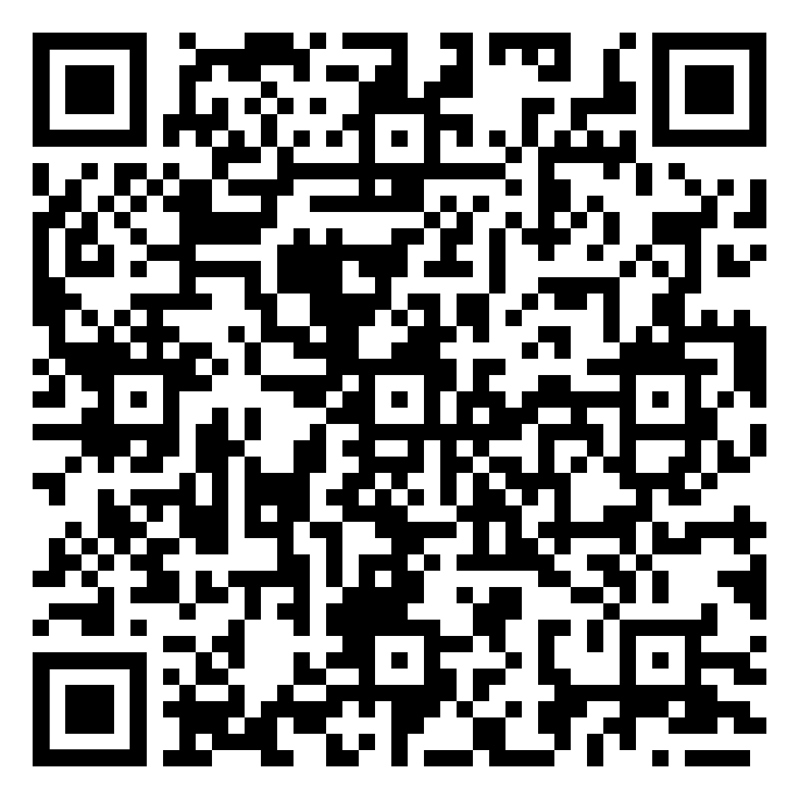
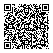
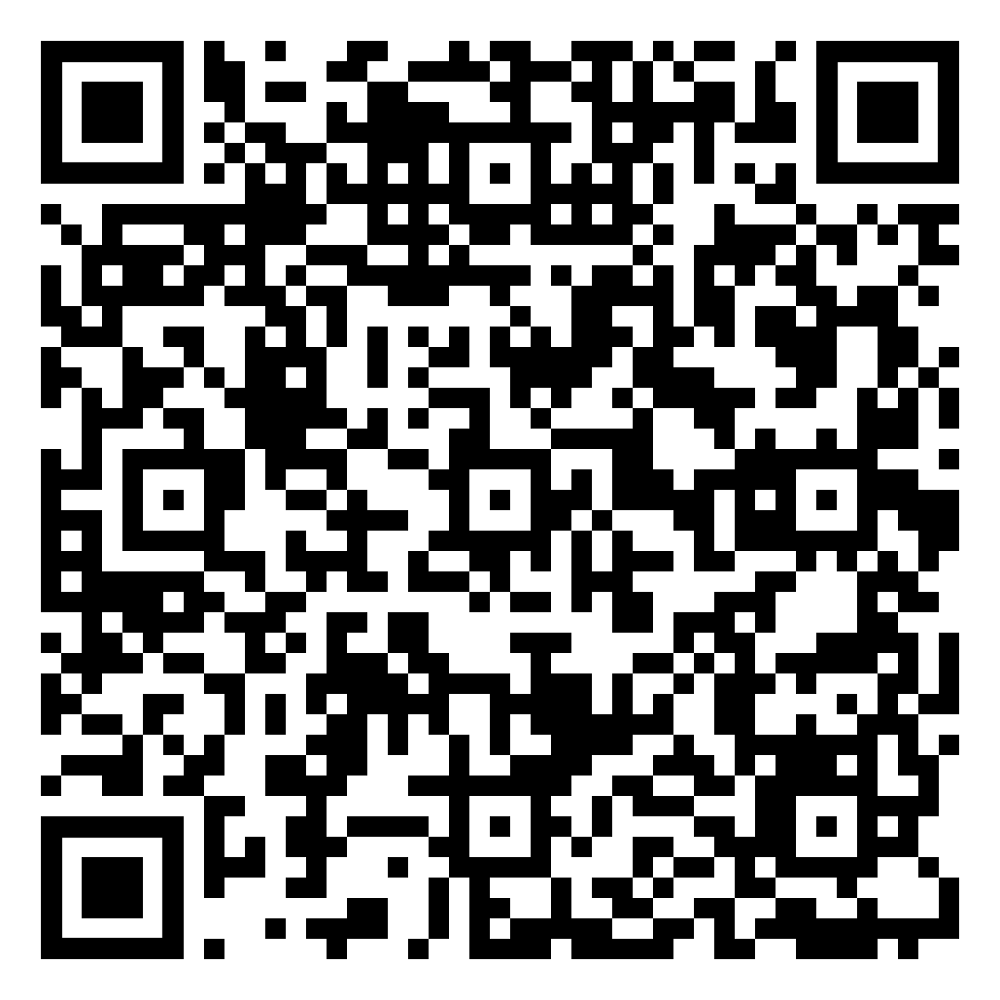
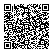
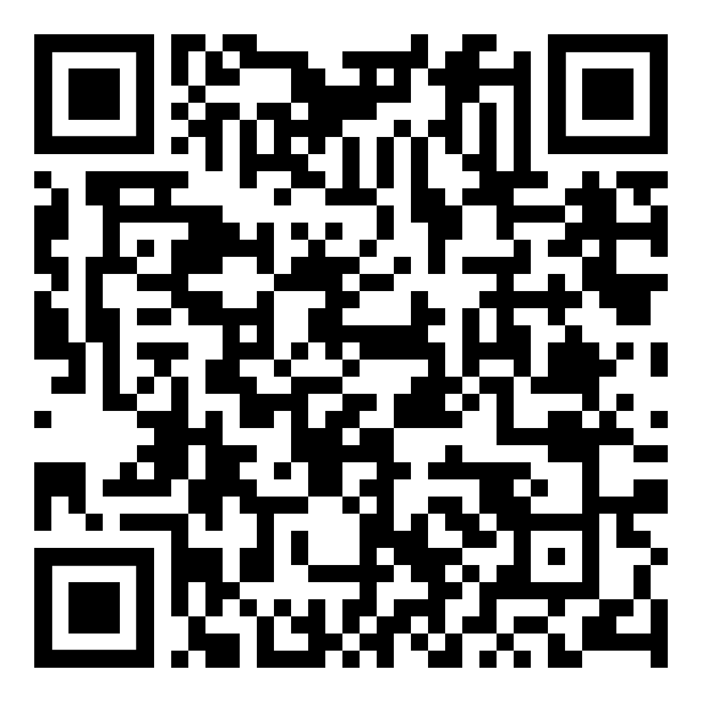
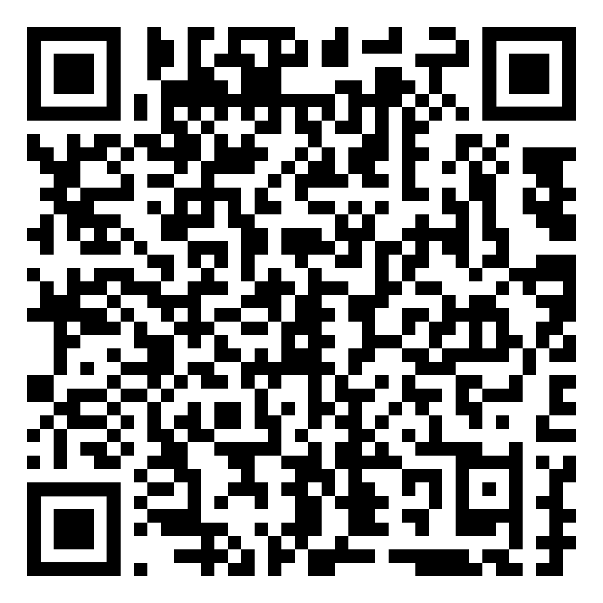
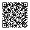
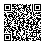
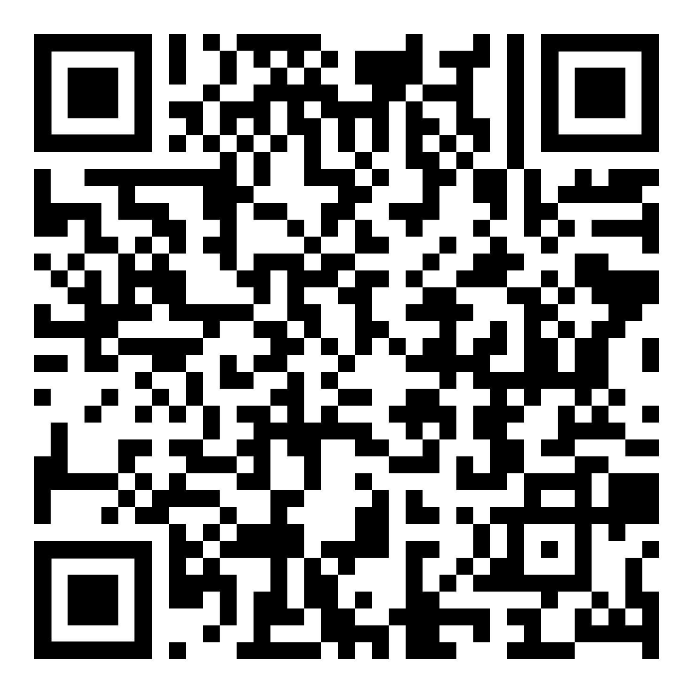

# `Shive` rules lists for `AdBlock` (or similar) plugins

The following lists are recommended to install:

| #  |         Title         |                  Link                  |            QR Code            |
|----|-----------------------|----------------------------------------|-------------------------------|
| 1  | AdGuard Base          |[Link](https://raw.githubusercontent.com/AdguardTeam/FiltersRegistry/master/filters/filter_2_Base/filter.txt)||
| 2  | AdGuard Spyware       |[Link](https://raw.githubusercontent.com/AdguardTeam/FiltersRegistry/master/filters/filter_3_Spyware/filter.txt)||
| 3  | AdGuard Social        |[Link](https://raw.githubusercontent.com/AdguardTeam/FiltersRegistry/master/filters/filter_4_Social/filter.txt)||
| 4  | AdGuard Experimental  |[Link](https://raw.githubusercontent.com/AdguardTeam/FiltersRegistry/master/filters/filter_5_Experimental/filter.txt)||
| 5  | AdGuard Mobile        |[Link](https://raw.githubusercontent.com/AdguardTeam/FiltersRegistry/master/filters/filter_11_Mobile/filter.txt)||
| 6  | AdGuard Annoyances    |[Link](https://raw.githubusercontent.com/AdguardTeam/FiltersRegistry/master/filters/filter_14_Annoyances/filter.txt)||
| 7  | AdGuard DNS           |[Link](https://raw.githubusercontent.com/AdguardTeam/FiltersRegistry/master/filters/filter_15_DnsFilter/filter.txt)||
| 8  | AdGuard Tracking      |[Link](https://raw.githubusercontent.com/AdguardTeam/FiltersRegistry/master/filters/filter_17_TrackParam/filter.txt)||
| 9  | Hagezi Thread Hunting |[Link](https://cdn.jsdelivr.net/gh/hagezi/dns-blocklists@latest/adblock/tif.txt)||
| 10 | Hagezi Pro.mini       |[Link](https://cdn.jsdelivr.net/gh/hagezi/dns-blocklists@latest/adblock/pro.mini.txt)||
| 11 | AdGuard RU            |[Link](https://raw.githubusercontent.com/AdguardTeam/FiltersRegistry/master/filters/filter_1_Russian/filter.txt)||
| 12 | AdGuard DE            |[Link](https://raw.githubusercontent.com/AdguardTeam/FiltersRegistry/master/filters/filter_6_German/filter.txt)||
| 13 | AdGuard ES            |[Link](https://raw.githubusercontent.com/AdguardTeam/FiltersRegistry/master/filters/filter_9_Spanish/filter.txt)||
| 14 | AdGuard FR            |[Link](https://raw.githubusercontent.com/AdguardTeam/FiltersRegistry/master/filters/filter_16_French/filter.txt)||

The following lists ar `NOT` recommended to install:

| #  |         Title         |                  Link                  |            QR Code            |
|----|-----------------------|----------------------------------------|-------------------------------|
| 1  | re-345YL15T           | [Link](alex-bv/sieve/lists/adblock.txt)||
| 2  | re-h05t5              | [Link](alex-bv/sieve/lists/hosts.txt)  ||
